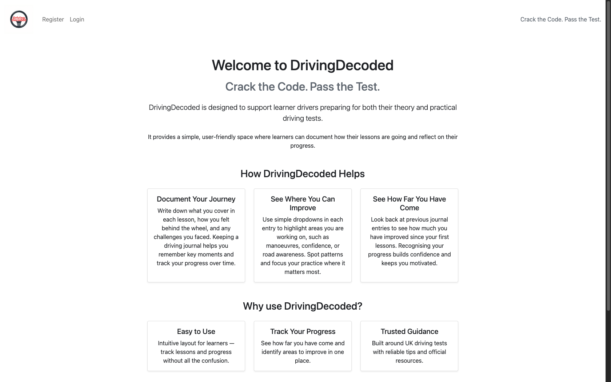
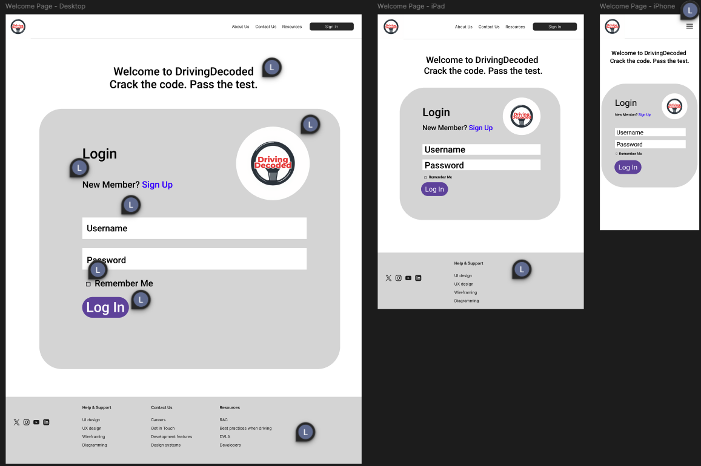
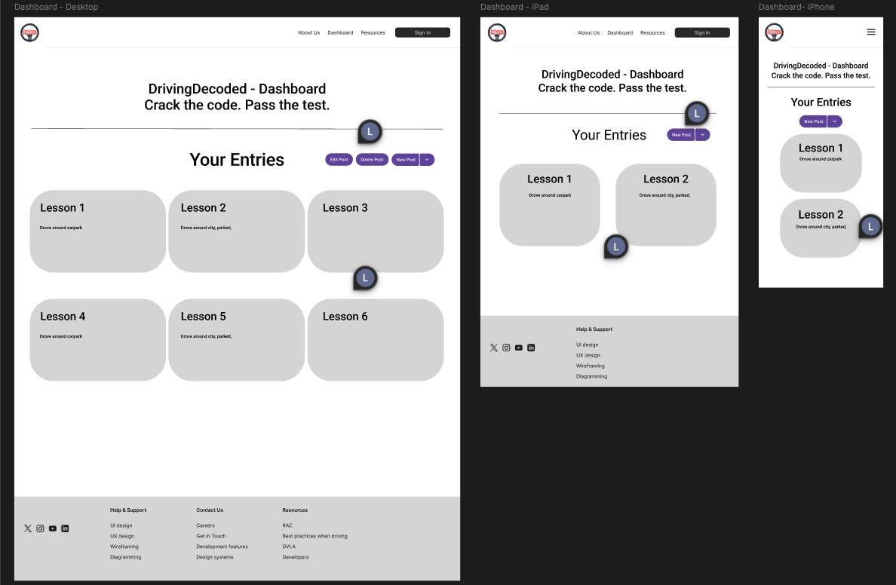
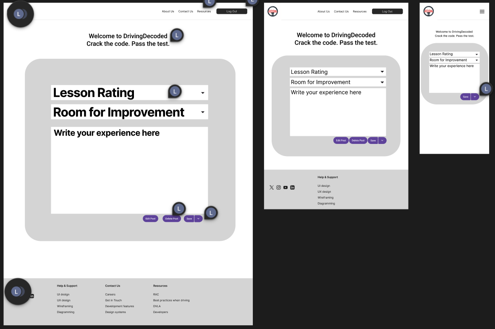

# DrivingDecoded

---

## DrivingDecoded - Crack the Code. Pass the Test.

## View DrivingDecoded now on GitHub Pages

---

## Table of Contents

- [Introduction](#introduction)
- [User Experience](#user-experience)
- [UX Design](#ux-design)
- [Features](#features)
- [Tools Used](#tools-used)
- [Wireframes](#wireframes)
- [Agile Development](#agile-development)
- [Deployment](#deployment)
- [AI Augmentation](#ai-augmentation)
- [End Credits](#end-credits)

### Introduction

**DrivingDecoded** is a Django-based web application designed for people learning to drive. Users can create an account and log in to a personalised dashboard where they can document their learning journey. The site acts as a digital journal, allowing learners to:

- **Write new posts** about their driving experiences and progress.
- **View past entries** to track their improvement over time.
- **Maintain a personal learning diary** in an organised and easy-to-use interface.

#### Website Purpose

**DrivingDecoded** is designed to support learner drivers preparing for both their **theory and practical driving tests**. The website provides a simple, user-friendly space where learners can document how their lessons are going and reflect on their progress.

##### Target Audience

- **Learner drivers** preparing for their theory or practical driving tests.

- **New drivers** who want to stay motivated by seeing how far they've come over time.

- **Anyone wanting to keep clear learning notes in one place**.

The website is designed for learner drivers who want a straightforward, easy-to-use interface where they can record their thoughts, feelings, and experiences throughout their driving journey. It provides a calm, focused space for reflecting on lessons, tracking progress, and building confidence over time.

### User Experience

#### Verifications

##### HTML & CSS

##### Python

##### Testing & Validation

##### Manual Testing

#### User Stories

**MoSCoW Prioritisation**

**Must Have:** 

- Responsive UI/UX design. 
- Fully functional and working links. 
- User registration and login. 
- Clear, concise, and easy-to-understand interface.
- Notification of changes sent to the user.

**Should Have:** 

- Calming background colours and themes throughout.

**Could Have (Future Enhancements):** 

- Advanced search capabilities.
- Notifications for the user to see updates and/or reminders. I.e. time to revise.

**Won't Have:** 

- Overly complex or overwhelming content that could confuse users.

***First Time Visitor Goals***

-   **As a first-time visitor**, I want to be able to sign in or create an account quickly so I can start using the website without confusion.

-   **As a first-time visitor**, I want to immediately understand the purpose of the website so I can decide whether it supports my learning needs.

-   **As a first-time visitor**, I want a simple way to start documenting my driving journey.

***Returning Visitor Goals***

-   **As a returning visitor**, I want to easily access all my previous posts so I can reflect on past lessons and continue learning from my experiences.

-   **As a returning visitor**, I want access to trusted resources, such as official UK government websites for mock tests, so I can practice with accurate and reliable materials.

-   **As a returning visitor**, I want the ability to edit or update my past posts to keep my driving journal accurate and up to date.

***Frequent Visitor Goals***

-   **As a frequent visitor**, I want to quickly log new entries so I can keep my driving journal updated without any unnecessary steps.

-   **As a frequent visitor**, I want a clear, organised view of all my posts so I can quickly review specific lessons or experiences when needed.

-   **As a frequent visitor**, I want reliable access to learning resources so I can continue preparing for both theory and practical tests.

#### User Value

### UX Design

#### Fonts

For simplicity, readability, and a uniform appearance across the application, the app uses the Arial sans serif font throughout. This choice ensures that text is easy to read on all devices and maintains a consistent style across pages.

#### Themes

The font colours are primarily black, with grey used occasionally for secondary text.

The background is white, ensuring strong contrast with the text for easy readability.

#### Logo

The **DrivingDecoded** logo was created using ***Canva AI***, allowing for a clean, sleek, distinctive design aligned with the website theme and brand. The image was then converted into favicon formats using ***Favicon.io*** to ensure clarity and consistency across browsers and devices, enhancing overall user recognition and experience.

***Full Website Logo***

***Favicon***

### Features

### Tools Used

#### Applications and Tools Used

- **VS Code** - Primary development environment.
- **Git & GitHub** - Used for version control, deployment, and documentation.
- **Heroku** - Used for hosting and deploying the site, providing a simple and reliable deployment workflow.
- **ChatGPT** - Used for learning support, including concept clarification and guidance when encountering challenges.
- **Canva AI** - Designed the project's steering-wheel logo.
- **Favicon.io** - Converted the logo into a full favicon set for browser compatibility.
- **Miro** - Used for creating the Entity Relationship Diagram (ERD).

#### Languages Used

- **Python** - Backend logic and server-side programming.
- **HTML5** - Structuring the web pages.
- **JavaScript** - Frontend interactivity and webpage responsiveness.

#### Libraries and Frameworks

- **Django** - Python web framework for backend development.
- **PostgreSQL** - Relational database used for storing and managing user data.
- **Bootstrap CSS** - CSS framework for responsive and mobile-first design.

### Wireframes

***Welcome Page Wireframe***

Below is the wireframe for the **welcome landing page**, which is the first screen users see when they visit the site.

At the top of the page, there is a welcome message which is the company moto.

Underneath the welcome message is the login section, which includes: 

- A clearly labelled **username input field** with a placeholder that reads 'Username'.
- A **password input field**, also with a placeholder reading 'Password'.
- A **'Remember Me'** checkbox that allows users to stay logged in on the device if desired.
- A **Login** button beneath the form fields.

Below the Login title there is a small line of text for new users: '**New Member? Sign Up'**, which will link to the registration page.

The layout is designed to be simple, accessible, and easy to navigate, allowing returning users to log in quickly and guiding new users to create an account.

***Dashboard Wireframe***

The dashboard page displays all the journal entries belonging to the logged-in user. At the top of the page, the heading 'Your Entries' appears, with action buttons aligned to the right:
- **Edit Post**
- **Delete Post**
- **New Post**

The layout will adapt to the screen size used:
- **Large Desktop Screens**: Entries are displayed on a 3-column grid.
- **Tablet Screens**: The layout reduces to a 2-column grid.
- **Mobile Screens**: Entries are shown in a single-column layout for readability.

Additionally, on small screens (tablet and below), the three action buttons collapse so that the **New Post** button remains primary, and the **Edit** and **Delete** options are placed inside a dropdown menu to conserve space and improve usability.

***Journal Entry Wireframe***

Below is the wireframe for the **Journal Entry** page. This page allows users to create or update their driving-lesson journal entry in a simple and structured way. 

The design includes **two dropdown selectors**:
- **Lesson Rating** - allows the user to choose from a set of predefined options describing how well the lesson went (e.g. Well, Fair, Bad, etc.)
- **Room for Improvement** - displays a list of common areas the user may need to work on (e.g. Steering, Breaking, Attention to Roads, etc.)

Below the dropdowns is a **large text area**, where users can freely write their journal reflection for that lesson.

At the bottom of the page, the wireframe includes **three action buttons**: **Edit, Delete,** and **Save**.

This wireframe outlines the core user-interaction elements for creating and managing journal entries within the app.

***Entity Relationship Diagram (ERD)***

For this project, I planned the database structure carefully to support the online journal functionality. The database consists of **two main tables**:

1. User - stores authentication data for each user (username, email, password hash, etc.)

2. Journal Entry - stores all journal entries, linked to a specific user. Each entry includes:

    - lesson_rating - how the driving lesson went, chosen from a dropdown. User can pick from a selection of options such as "Fair", "Good", "Poor" etc. 
    - improvement_area - what the user needs to improve, chosen from a dropdown. User can pick from a selection of options such as "Attention", "Steering", "Breaking" etc.
    - notes - this is the text field for the user to create free-form reflections of their learning journey.
    - Timestamps for **created_at** and **updated_at**.

I used **Miro** to create the board and organise the tables visually. I reviewed online examples and ChatGPT suggestions to make sure the tables included all necessary fields and that the data types were appropriate. For dropdowns like lesson ratings and improvement areas, I chose CharFields with predefined choices, which ensures that only valid options are stored.

### Agile Development

Throughout development, I followed an **agile approach** to building the application:

- After each push to GitHub or any set of changes, I reflected on how my progress toward completion had evolved.
- I adapted future development steps based on these reflections, ensuring that each iteration aligned with the current state of the project.
- New ideas were incorporated as they arose, and plans that no longer fit the project's direction were revised or removed.
- This iterative process allowed the project to remain flexible, responsive, and focused on producing a functional, user-friendly application. 

### Deployment

#### To GitHub

#### To Heroku

### AI Augmentation

**AIs used in creating this project**:

- ChatGPT
- Canva AI

### End Credits

#### Acknowledgements